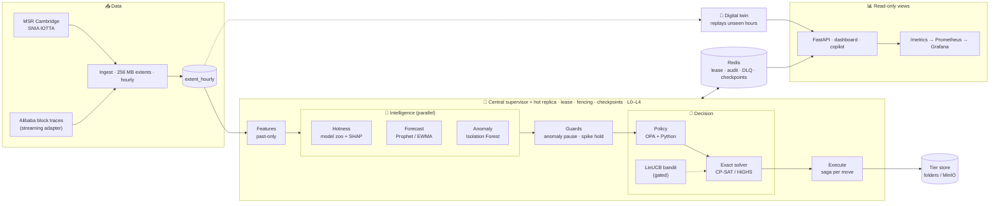

<div align="center">

# 🗂️ Ayojna

### A recommendation engine that plans where every byte should live

**Predict tomorrow's hot data · Place it on the cheapest storage that keeps its promises · Move it safely, even when things fail**

<br/>


-F59E0B?style=flat-square)


<br/>

| 💰 **61.8%** cheaper than all-hot | 📉 **14.5%** cheaper than the best compliant rule | ⚡ **100%** SLA met | 🛡️ **100%** compliance |
|:---:|:---:|:---:|:---:|
| *real MSR traces, unseen hours, median of 5 replays (59.8–62.4%)* | *median of 5 (range 10.0–15.8%); target was ≥ 15%* | *median of 5 (worst 99.5%)* | *legal hold never violated* |

</div>

> **Honesty first.** Every number here is measured on hours the models never saw, and the cost headline is a **median of 5 replays with its range**, not the best run. Where we missed a target, we say so (see [Results](#-results) and [Limitations](#️-limitations)).

---

## 📑 Contents

1. [The problem](#-the-problem)
2. [What Ayojna does](#-what-ayojna-does)
3. [Architecture](#️-architecture)
4. [Where each slide lives in the code](#️-where-each-slide-lives-in-the-code)
5. [How a decision is made](#-how-a-decision-is-made)
6. [Reliability: the central layer](#-reliability-the-central-layer)
7. [Results](#-results)
8. [Limitations](#️-limitations)
9. [Tech stack](#-tech-stack)
10. [Quick start](#-quick-start)
11. [Validation commands](#-validation-commands)
12. [Live demo script](#-live-demo-script)
13. [API](#-api)
14. [Repository structure](#️-repository-structure)
15. [Testing](#-testing)
16. [Design decisions](#-design-decisions)
17. [Team and credits](#-team-and-credits)

---

## 🔥 The problem

Enterprises keep most of their data on **expensive, fast storage**, although most of it is rarely read. Static rules ("move it after 30 days") are cheap to run but blind: they demote data just before it gets busy, ignore legal holds and never price the cost of moving.

| Tier | Example | Price ($/GB-month) | Latency |
|---|---|---:|---:|
| 🔴 Hot | NVMe / premium SSD | 0.100 | 0.1 ms |
| 🟠 Warm | Standard SSD | 0.045 | 0.5 ms |
| 🔵 Cold | HDD / infrequent access | 0.0125 | 8 ms |

---

## 💡 What Ayojna does

Every cycle, for every 256 MB extent, Ayojna answers one question: **"Where should this live for the next 24 hours, and is moving it worth it?"** It then recommends the move (or performs it, with or without approval) and explains why.

| Layer | What it does |
|---|---|
| 🔮 **Intelligence** | A model zoo (LightGBM, XGBoost, Random Forest, HistGB) predicts each extent's hotness for the next 24 h; the champion is picked on a validation window and explained with TreeSHAP. A forecaster (Prophet, fallback seasonal EWMA) predicts capacity and I/O; an Isolation Forest flags anomalies. The three run **in parallel** under the supervisor. |
| 🧮 **Decision** | A policy guard (OPA / Rego, cross-checked by a Python guard) removes illegal tiers first. An **exact solver** (OR-Tools CP-SAT, else HiGHS MILP) picks the cheapest allowed placement under capacity, queueing (SLA) and a migration budget. A **LinUCB contextual bandit** tunes how bold to be, and is promoted only if it beats static settings on a validation day. |
| 🔁 **Central** | A supervisor and a hot replica share state in **Redis** (lease, fencing token, checkpoints, audit log, dead-letter queue). Fail-safe levels L0–L4 and an operator safe-mode switch. |
| 🧾 **Execution** | Copy → verify checksum → commit → delete, as a saga with rollback. Idempotent, so a replica can resume a half-done run. |
| 📊 **Observe and validate** | Web dashboard, grounded AI copilot, Prometheus `/metrics` and a Grafana dashboard, a slide 6 KPI scorecard, a chaos drill, a robustness run and a generalization test. |

---

## 🏗️ Architecture



> 💡 **Only the Execute step touches stored data.** Everything else decides or reads, so the dashboard, copilot and Grafana can fail without affecting storage.

---

## 🗺️ Where each slide lives in the code

| Slide claim | Where it is | How to see it |
|---|---|---|
| Hotness prediction, explained | `models/hotness.py`, `models/train_hotness.py` (zoo, champion, TreeSHAP / occlusion) | Dashboard → Intelligence layer |
| Capacity / I/O forecast | `models/forecast.py` | `python -m ayojna.models.train_all` |
| Anomaly detection + guards | `models/anomaly.py`, `planner/guards.py` | Dashboard → Intelligence layer |
| Parallel steps, timeouts, fallbacks | `supervisor/runner.py` (`Parallel`) | `--fail hotness`, `--slow forecast` |
| Policy as code | `config/policy.rego` + `policy/guard.py` | `GET /api/decision` |
| Exact optimizer | `planner/exact.py` | Dashboard → Decision layer |
| Reinforcement learning | `planner/bandit.py` (LinUCB, shadow until it wins) | Dashboard → Decision layer |
| Shared state, failover, DLQ, L4 | `supervisor/state.py`, `supervisor/resp.py`, `supervisor/run.py` | Dashboard → Central layer |
| Grafana live KPIs | `api/metrics.py`, `config/grafana/` | `localhost:3000` |
| Slide 6 KPIs | `validate/kpi_report.py` | Dashboard → Slide 6 scorecard |
| Fault tolerance | `validate/chaos.py` | `python -m ayojna.validate.chaos` |
| Works on other workloads | `ingest/alibaba.py`, `validate/generalize.py` | Dashboard → Generalization & robustness |

---

## 🧮 How a decision is made

1. **Features (past only).** For each extent and hour: accesses over 1/6/24/72 h, trend, read ratio, I/O size, randomness, hours since last access. No feature looks into the future (tested).
2. **Hotness.** The champion model predicts hot / warm / cold for the next 24 h, with a confidence. Below the confidence floor it abstains and the rule decides.
3. **Guards.** Volumes with an anomaly are frozen for the cycle; volumes with a predicted spike may be promoted but not demoted.
4. **Policy.** Legal hold, SLA floors and no-archive rules remove tiers *before* any price is looked at. If OPA and the Python guard disagree, the volume is frozen (fail closed).
5. **Price and solve.** For each allowed tier: storage + retrieval + move + early-deletion fees over 24 h, under hot capacity, per-tier queue limits (the SLA) and a migration budget. Solved exactly; greedy is the fallback, and the exact plan is never worse (tested).
6. **Recommend or act.** Moves are grouped into recommendations with saving, risk and reasons. They run automatically, or only after approval (`--approval`).

---

## 🔁 Reliability: the central layer

| Mechanism | What it guarantees | Measured |
|---|---|---|
| Lease + fencing token (Redis Lua scripts) | Exactly one leader acts; a stale leader is refused | Failover **8.5–8.9 s** (target ≤ 10 s) |
| Checkpoints + idempotent moves | A replica resumes; nothing is done twice | Crash after 40 moves → 40 skipped, 0 duplicates |
| Step fallbacks | A broken model or planner degrades instead of crashing | Chaos drill: **12 cycles, 100% completed safely, 0 unsafe** |
| Dead-letter queue | Every failed step and rolled-back move is kept with its real error | `GET /api/central` |
| Fail-safe levels | L0 normal · L1 model fallback · L2 recommend only · L3 hold · **L4 safe mode** (no leader, or operator switch) | `python -m ayojna.supervisor.safe_mode on` |

The state store is Redis when it is reachable and a file store otherwise (same interface), so the project also runs on a laptop without Docker.

---

## 📈 Results

All results use 8 real MSR Cambridge volumes (hm_0, mds_0, prn_0, proj_0, src1_2, ts_0, usr_0, web_0) over one common week (hours 0–167, when every trace is recording), **scored only on unseen hours 120–167**.

### Digital-twin race (one replay)

| Strategy | $ / month | Saving vs all-hot | SLA met | Compliance | GB moved |
|---|---:|---:|---:|---:|---:|
| all_hot | 21.08 | 0.0% | 100.00% | 100.0% | 0 |
| age_rule | 9.93 | 52.9% | 99.99% | 98.0% | 17.75 |
| access_timer | 13.54 | 35.7% | 100.00% | 98.0% | 15.0 |
| lru | 10.27 | 51.3% | 100.00% | 96.2% | 180.0 |
| lfu | 7.86 | 62.7% | 100.00% | 97.5% | 21.5 |
| lru + policy | 11.16 | 47.0% | 100.00% | 100.0% | 129.75 |
| lfu + policy | 9.41 | 55.4% | 100.00% | 100.0% | 21.0 |
| **ayojna** | **7.92** | **62.4%** | **100.00%** | **100.0%** | **15.5** |

Plain LFU is slightly cheaper, but only because it breaks policy on 2.5% of placements (legal-hold data). **We compare with the best rule that is also 100% compliant** (`lfu + policy`); this replay is 15.8% cheaper.

### Robustness: median of 5 replays

| Measure | Median | Range |
|---|---:|---:|
| Saving vs all-hot | **61.8%** | 59.8 – 62.4% |
| Cheaper than the best compliant rule | **14.5%** | 10.0 – 15.8% |
| SLA met | **100%** | 99.5 – 100% |
| GB moved | 16.25 | 15.5 – 20.5 |

Each replay feeds the same data with a 1e-9 relative perturbation, which only changes how near-ties are broken. That the result still moves by a few points shows how close several placements are in cost, so we report the median.

### Slide 6 scorecard (`python -m ayojna.validate.kpi_report`): 5 of 9 targets met

| Measure | Target | Ayojna | Verdict |
|---|---|---|---|
| Storage cost vs best rule | ≥ 15% lower at equal SLA | 14.5% (median of 5; range 10.0–15.8%) | ❌ MISS (close) |
| Performance SLA | ≥ 99% of I/Os in target | 100% | ✅ |
| Hotness accuracy | macro-F1 ≥ 0.85 | 0.724 (rule 0.596) | ❌ MISS |
| Hot-tier hit ratio | above LRU / LFU | 34% (LRU 69%, LFU 91%) | ❌ MISS by design: busy data is served from warm when the SLA allows, which is cheaper |
| Capacity forecast | MAPE < 15% | 3.1% (24 h ahead) | ✅ |
| Compliance | 100% | 100% | ✅ |
| Data movement | ≤ 5% of I/O | 8.5% | ❌ MISS |
| Availability under failure | ≥ 99.9% cycles complete | 100% (chaos drill) | ✅ |
| Failover | ≤ 10 s | 8.5 s | ✅ |

### Generalization: volumes the model never saw (`python -m ayojna.validate.generalize`)

Trained on hm_0, prn_0, src1_2, usr_0 → tested on mds_0, proj_0, ts_0, web_0 (every other volume in sorted order, no hand-picking).

| | Result |
|---|---|
| Hotness model | macro-F1 **0.665** vs rule 0.625: **the model transfers** |
| Planner | 33.6% cheaper than all-hot, **SLA 92.6%**: **the plan does not transfer well** (see Limitations) |
| Compliance | 100% |

### Decision layer

| | Result |
|---|---|
| Exact solver (HiGHS) | Optimal in 48 of 48 hours, about 76 ms per solve, never worse than greedy |
| RL bandit | Lost to static settings on the validation day → **kept in shadow mode** (the gate works as designed) |
| Forecast | Capacity MAPE 3.1%, I/O MAPE 34.7% (24 h ahead) |

### Synthetic 7-day trace (sanity check only)

68.5% cheaper than all-hot and 37.8% cheaper than the best compliant rule, at 100% SLA. Synthetic data is easier than real data, so we do not use it as the headline.

---

## ⚠️ Limitations

- **The ≥ 15% cost target is not reliably met on real data.** The median is 14.5%; only the best replay passes. The compliant baseline (LFU + policy) is a strong rule.
- **Cross-volume planning.** On unseen volumes the planner reaches only 92.6% SLA and costs more than simple rules. The hotness model is not the cause: a model trained on all 8 volumes gives about the same result on this subset. Two things are. Move and early-deletion fees are about a third of the bill (proj_0 is demoted to cold, then promoted back when it bursts), and capacity is tight on a 4-volume subset. Next step: price the risk of re-promotion in the optimizer. A peak-based queue limit fixed the subset (100% SLA) but cut the full-data result vs the best rule from 12.3% to 7.4%, so we did not adopt it.
- **Alibaba not yet run end to end.** The adapter streams the 181 GB archive with early stop and is tested, but access needs a survey; the cross-dataset run happens once the team has the trace.
- **One week of data.** A 7-day forecast and weekly patterns cannot be scored on a 1-week trace, so forecasts are scored 24 h ahead.
- **Compliance tags are synthetic** (per volume, in YAML); a real deployment would read them from a metadata catalog.
- **Not built (stretch goals):** LSTM forecaster, English → policy translation.

---

## 🧰 Tech stack

| Area | Used |
|---|---|
| Data | pandas, NumPy, PyArrow (Parquet) |
| ML | scikit-learn, LightGBM, XGBoost, TreeSHAP (native in LightGBM / XGBoost), Prophet, Isolation Forest |
| Optimization | OR-Tools CP-SAT, HiGHS (SciPy MILP) |
| RL | LinUCB contextual bandit (NumPy) |
| Policy | Open Policy Agent (Rego v1) + Python guard |
| State | Redis 7 (built-in RESP client, Lua scripts), file store fallback |
| Storage | Local tier folders or MinIO (S3 API) |
| API and UI | FastAPI, Uvicorn, a single-page web dashboard (Chart.js) |
| Observability | Prometheus, Grafana |
| AI copilot | Gemini / Groq (optional), grounded and read-only; templates without a key |
| Infra | Docker Compose |

Optional libraries (LightGBM, XGBoost, Prophet, OR-Tools) are skipped cleanly when missing; the leaderboard shows "not installed" and the next option is used.

---

## 🚀 Quick start

```bash
git clone https://github.com/vaishnavi-212/Ayojna.git && cd Ayojna
python -m venv .venv
source .venv/bin/activate                 # Windows: .\.venv\Scripts\Activate.ps1
pip install -r requirements.txt && pip install -e .
pip install -r requirements-ml.txt        # optional: LightGBM, XGBoost, Prophet

python -m pytest -q                       # all tests
python -m ayojna.demo --serve             # synthetic trace → http://localhost:8000
```

### Real MSR Cambridge traces

1. Download **MSR Cambridge Traces** from [SNIA IOTTA](https://iotta.snia.org/traces/block-io/388) (accept the license).
2. Put the archive(s) in `data/raw/msr/` without unzipping.
3. `python -m ayojna.demo --source real --serve`

### Alibaba block traces (cross-dataset test)

Access needs a short survey ([github.com/alibaba/block-traces](https://github.com/alibaba/block-traces)). The archive is 181 GB, but **you do not need to download all of it**: the adapter streams it and stops after `--days`.

```bash
python -m ayojna.ingest.alibaba --src <alibaba .tar.gz path or https link> --first 8 --days 5
python -m ayojna.validate.generalize --eh data/lake/extent_hourly.parquet --target data/lake/alibaba_eh.parquet
```

### Full stack (Redis, OPA, MinIO, Prometheus, Grafana)

```bash
docker compose up -d
python -m ayojna.supervisor.run --state-store redis --cycles 5
```

Grafana: `localhost:3000` (dashboard "Ayojna") · Prometheus: `localhost:9090` · OPA: `localhost:8181`. Without Docker, everything falls back to files and the Python policy guard.

### Optional AI copilot

Copy `.env.example` to `.env` and add `GEMINI_API_KEY` and/or `GROQ_API_KEY`. `.env` is git-ignored.

---

## 🔬 Validation commands

| Command | Writes | Shows |
|---|---|---|
| `python -m ayojna.validate.robustness --runs 5` | `data/lake/robustness.json` | Median and range of the headline |
| `python -m ayojna.validate.kpi_report` | `data/lake/kpi_report.json/.md` | Slide 6 scorecard |
| `python -m ayojna.validate.chaos` | `data/lake/chaos_report.json` | 12 cycles with injected faults |
| `python -m ayojna.validate.generalize` | `data/lake/generalization.json/.md` | Train on some volumes, test on others |

Run `robustness` before `kpi_report`: the scorecard then judges the cost target on the median, not on one replay.

---

## 🎬 Live demo script

| # | Show | Command | What the judges see |
|:-:|---|---|---|
| 1 | Whole pipeline | `python -m ayojna.demo --source lake --serve` | 7 stages, then the results table |
| 2 | Recommendations | open `localhost:8000` | Grouped moves with saving, risk and reasons; approve / reject |
| 3 | Intelligence + decision | dashboard panels | Champion model, parallel step times, solver, bandit gate, OPA agreement |
| 4 | Failover | primary `--crash-after-moves 40`, then a replica | New fencing token, 40 skipped, about 8.5 s gap |
| 5 | Safe mode | `python -m ayojna.supervisor.safe_mode on --reason demo` | Badge turns **L4**, nothing moves |
| 6 | Honest scorecard | dashboard → Slide 6 scorecard, Generalization & robustness | 5 of 9 met, misses explained |
| 7 | Grafana | `localhost:3000` | Live KPIs from `/metrics` |

---

## 🔌 API

| Endpoint | Returns |
|---|---|
| `GET /api/kpis` | Saving vs all-hot and vs the best compliant rule, SLA, compliance, level |
| `GET /api/status` · `GET /api/central` | Leader, token, level, failovers, dead letters |
| `POST /api/safe-mode` | Operator L4 switch |
| `GET /api/intel` · `GET /api/decision` | Model zoo, forecast, anomaly · policy, solver, bandit |
| `GET /api/recommendations` · `POST /api/recommendations/decide` | Recommendations · human approval |
| `GET /api/plan` · `/api/execution` · `/api/audit` · `/api/explain/{volume}/{extent}` | Plan, execution, audit trail, per-extent explanation |
| `GET /api/kpi-report` · `GET /api/validation` | Slide 6 scorecard · robustness + generalization |
| `GET /metrics` | Prometheus text format |
| `POST /api/ask` | Grounded copilot answer |

---

## 🗂️ Repository structure

```
Ayojna/
├── ayojna/
│   ├── ingest/       📥 MSR · Alibaba (streaming) · synthetic generator
│   ├── models/       🔮 features · hotness zoo · forecast · anomaly · training
│   ├── policy/       🛡️ Python guard + OPA client
│   ├── planner/      🧮 optimizer · exact solver · bandit · guards · evaluation
│   ├── supervisor/   🔁 runner · Redis / file state · RESP client · safe mode · CLI
│   ├── executor/     🧾 tier store (folders / MinIO) · catalog · move saga
│   ├── twin/         🧪 digital twin · baseline strategies · race
│   ├── recommend/    💬 recommendation engine + approvals
│   ├── validate/     ✅ KPI scorecard · chaos · robustness · generalization
│   ├── api/          🔌 FastAPI · service · Prometheus metrics
│   ├── copilot/      🤖 grounded LLM copilot
│   └── demo.py       🎬 one command for the whole pipeline
├── config/           ⚙️ YAML configs · policy.rego · prometheus.yml · grafana/
├── docs/             📝 PPT_CHANGES.md
├── tests/            ✅ unit + integration tests
├── web/index.html    📊 dashboard
└── docker-compose.yml 🐳 MinIO · Redis · OPA · Prometheus · Grafana
```

Raw traces, the data lake, state and trained models are git-ignored. The traces are not redistributed.

---

## ✅ Testing

```bash
python -m pytest -q
```

| Area | What the tests prove |
|---|---|
| Ingest | Bad rows rejected; streaming equals in-memory; Alibaba streams from a tar.gz and stops early |
| ML | No future leakage; champion chosen on validation; fallbacks when a library is missing |
| Decision | Exact plan never worse than greedy; capacity, queue and budget respected; OPA and Python agree; fail closed |
| Central | Redis lease, fencing, takeover, dead letters, L4 safe mode, crash resume |
| Executor | Idempotent replay, rollback on a bad copy, a fenced leader moves nothing |
| Validate | Scorecard, chaos drill, robustness median, generalization split |
| API and observability | Valid Prometheus text (checked with promtool when installed); Grafana queries only exported metrics |

---

## 🧠 Design decisions

| Choice | Reason |
|---|---|
| 256 MB extents, 24 h horizon | Small enough to target hot spots; one daily decision |
| Rule baseline + promotion gate | ML (and RL) must earn their place on a validation window |
| Policy before price, fail closed | Compliance can never be traded for money |
| Exact solver with greedy fallback | Optimal when possible, always an answer |
| Compare with the best *compliant* rule | Rules that break policy are not a fair baseline |
| Median of replays, unseen hours only | A result that holds for one lucky run is not a result |
| Read-only, grounded copilot | Explanation adds trust; decision power would add risk |

---

## 👥 Team and credits

<div align="center">

**Team CodeBlooded · Hackfest 2026 · Problem Statement 2A**

| Bhoomi B | Vaishnavi K | Joel B | Aditya P |
|:---:|:---:|:---:|:---:|

</div>

**Datasets.** MSR Cambridge block I/O traces, [SNIA IOTTA](https://iotta.snia.org/traces/block-io/388): D. Narayanan, A. Donnelly, A. Rowstron, *"Write Off-Loading: Practical Power Management for Enterprise Storage"*, USENIX FAST 2008. Alibaba block traces: [github.com/alibaba/block-traces](https://github.com/alibaba/block-traces). Traces are used under their licenses and are not redistributed here.

<div align="center">
<sub><i>Ayojna</i> (आयोजना) means "planning"</sub>
</div>